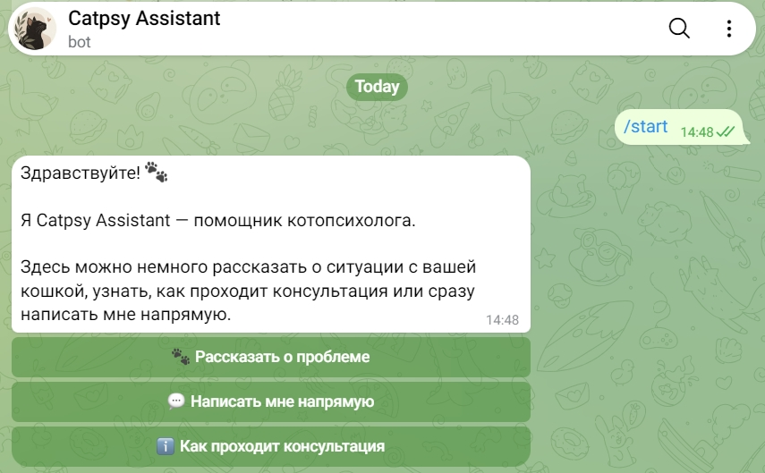
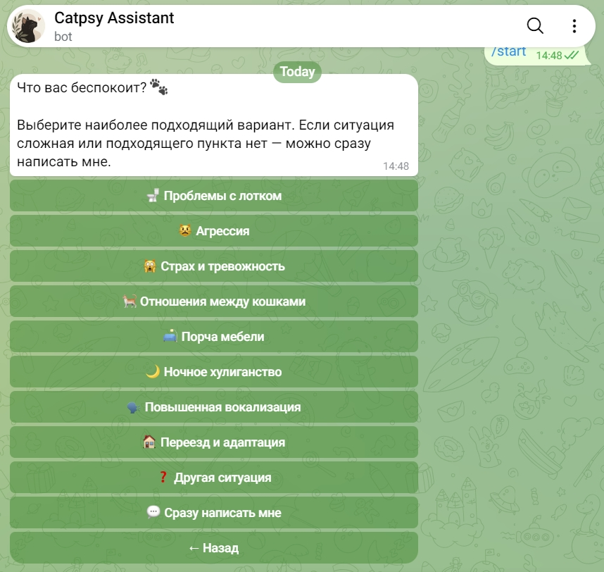
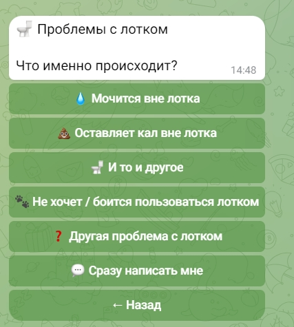
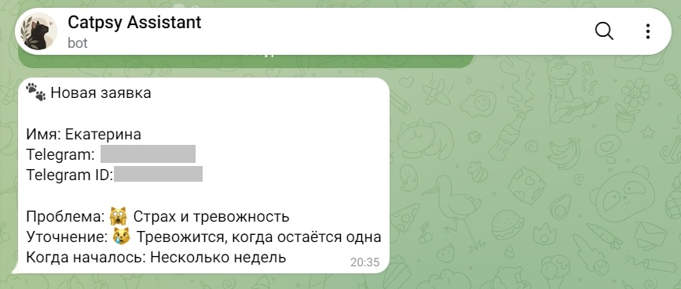

# Catpsy Assistant 🐾

Telegram-бот для автоматизации первичного обращения клиента к котопсихологу.

Бот помогает пользователю выбрать причину обращения, знакомит с форматом консультации, собирает контактные данные и формирует заявку для специалиста.

## Что умеет

- запускать интерактивный сценарий общения с пользователем;
- предлагать выбор проблемы с помощью кнопок;
- показывать информацию о формате консультации;
- собирать контакт пользователя;
- формировать заявку с данными обращения;
- автоматически отправлять заявку в закрытый админ-чат;
- работать через webhook;
- перенаправлять пользователя к контакту специалиста.

## Как работает

Пользователь последовательно проходит сценарий:

`Запуск бота → выбор проблемы → информация о консультации → контакт → заявка → админ-чат`

Состояние диалога сохраняется между этапами, поэтому бот может последовательно собирать необходимые данные и формировать итоговую заявку.

## Пример работы

### Пользовательский сценарий

После запуска бот предлагает основные варианты взаимодействия:

Пользователь может выбрать категорию проблемы:

Для отдельных категорий бот уточняет ситуацию:

### Результат

После прохождения сценария бот формирует структурированную заявку и отправляет её специалисту в закрытый админ-чат:

## Технологии

- Python
- aiogram
- Telegram Bot API
- FSM (Finite State Machine)
- Webhook
- Render
- Git / GitHub

## Структура проекта

- `bot.py` — логика Telegram-бота, пользовательские сценарии, обработка состояний и отправка заявок;
- `requirements.txt` — зависимости проекта;
- `.gitignore` — исключение локальных и конфиденциальных файлов из Git.

## Развёртывание

Бот развёрнут на Render и работает через webhook.

Конфиденциальные настройки передаются приложению через переменные окружения:

- `BOT_TOKEN` — токен Telegram-бота;
- `ADMIN_CHAT_ID` — ID закрытого чата для получения заявок;
- `WEBHOOK_URL` — адрес приложения.

Реальные значения этих переменных не хранятся в коде проекта.

## О проекте

Проект создан для собственного сайта котопсихолога и решает реальную задачу первичного взаимодействия с потенциальным клиентом.

При разработке я продумала пользовательский сценарий и структуру диалога, определила логику сбора и передачи данных, настроила работу Telegram-бота и webhook, тестировала сценарии, разбирала ошибки и дорабатывала проект с использованием ИИ как инструмента разработки.
